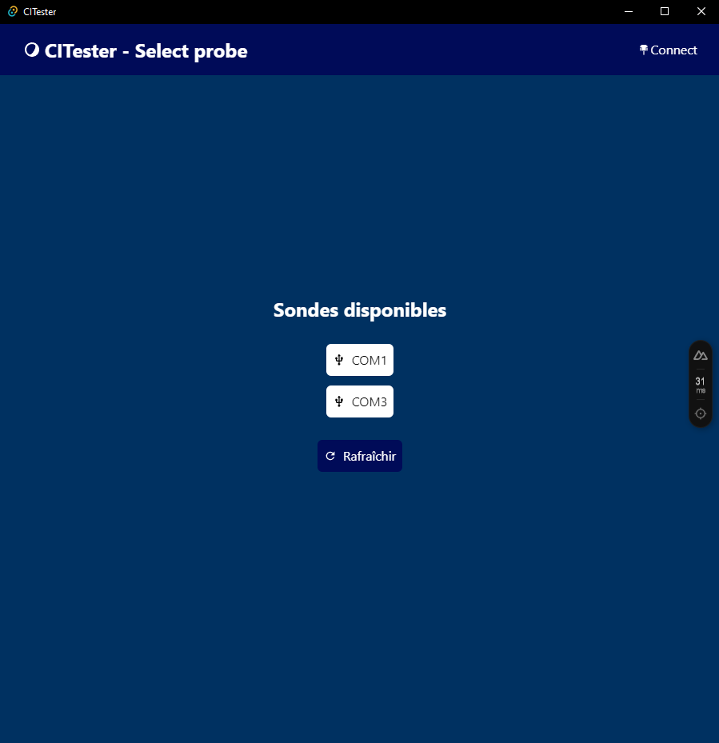

# CITester

## Présentation

Ce projet est un outil de test de CI. Il permet de tester une CI en utilisant un arduino.
Le micro-programme est disponible [ici](https://github.com/Churros98/CITester-Arduino).

Il est nécessaire d'utiliser un arduino pour le test de la CI.

## Images

